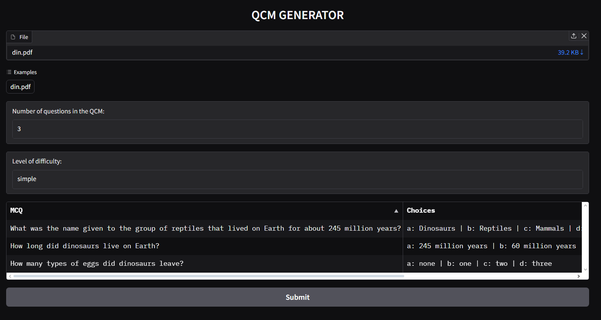

# MCQ Generator 🤔❓

This multiple-choice question generator uses an LLM from AI21 through an API to extract the theme of the pdf uplaoded by the user and then create a QCM from it, with the desired number of questions and level of dificulty. Langchain has been used to chain the different AIs collaborating in this project and Gradio was used for the front end.

Note: the API is free for a limited time after wich you ll have to use your own api_key

## Installation 🛠️
install the prerequisite through:

`pip install -r requirements.txt`

Then run this command:

 `python GradioAPP.py`
## Usage/Examples 🦖

Here is an example of QCM (3 simple questions with solution) generated from a pdf containg infos about dinosaurs `din.pdf`:

  

## License 📜

[MIT](https://choosealicense.com/licenses/mit/)
